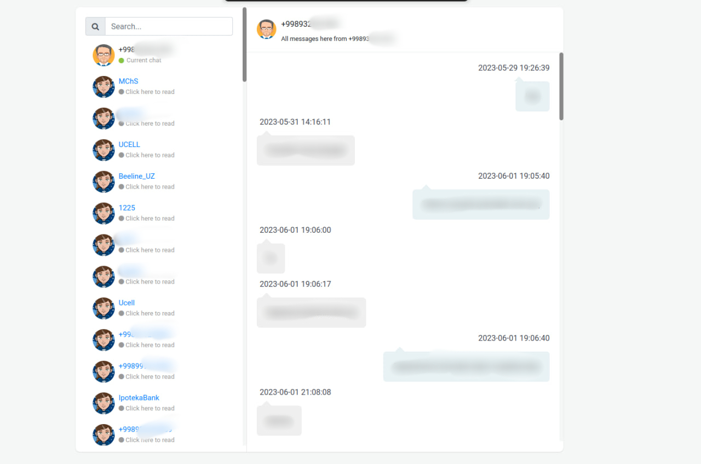

# Metasploit SMS and Call Dump Viewer

This repository provides a web-based tool to view dumped SMS and call data from Metasploit in a visually appealing
chat-style format. The tool allows users to upload their dumped files securely without storing them in a database.

## Features

- Parses dumped SMS and call data from Metasploit.
- Organizes the data in a chat-like interface for easy visualization.
- Supports various message and call attributes such as sender, receiver, timestamp, and message content.
- Customizable styling options to suit your preferences.

# Screenshot

## Usage

1. Clone this repository:

```bash
git clone https://github.com/ganiyevuz/metasploit-sms-call-dump-viewer.git
cd metasploit-sms-call-dump-viewer
```

2. Install the required dependencies:

```bash
pip install -r requirements.txt
```

3. Start the web server:

```bash
python manage.py runserver
```

4. Open your web browser and navigate to http://localhost:8000.

5. Click on the "Upload" button and select your dumped SMS and call data file generated from Metasploit.

6. The tool will parse the data and display it in a chat-style format directly in your browser.

## Customization
You can customize the appearance of the chat interface by modifying the CSS file (styles.css). Feel free to experiment
with different colors, fonts, or layouts to match your preferences.

## Security
The tool does not store the uploaded files in a database, ensuring the security and privacy of your data. However,
exercise caution while handling sensitive information and ensure that you are complying with relevant privacy laws and
regulations.

## Disclaimer
Please note that using Metasploit or any hacking tools without proper authorization is illegal and unethical. This
repository is intended for educational and research purposes only. Always ensure that you have the necessary permissions
and abide by the applicable laws and regulations.

## License
This project is licensed under the MIT License.
